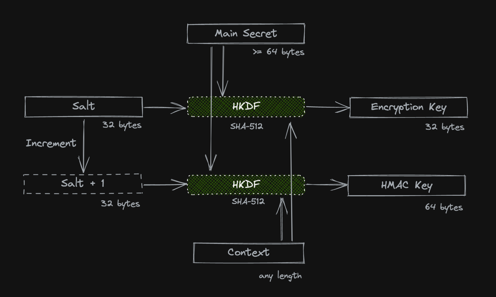
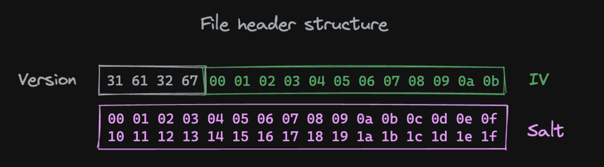
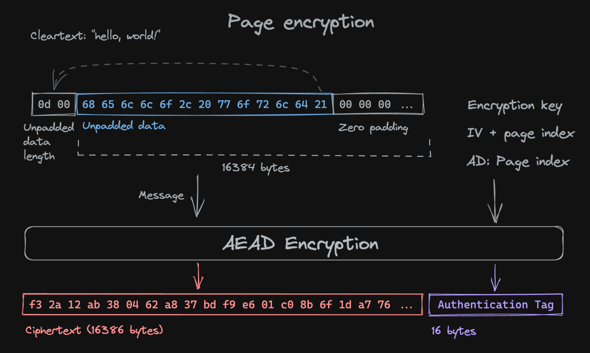

# `@socialgouv/streaming-file-encryption`

Streaming encryption/decryption for files in Node.js made simple and secure.

## Installation

```shell
pnpm add @socialgouv/streaming-file-encryption
yarn add @socialgouv/streaming-file-encryption
npm i @socialgouv/streaming-file-encryption
```

## Usage

> _**Note**: requires Node.js v15 or superior._

To get started, you will need a main secret _(64 bytes hex-encoded)_:

```ts
import { generateSerializedMainSecret } from '@socialgouv/streaming-file-encryption'

const serializedMainSecret = generateSerializedMainSecret()
```

Or do so via the CLI:

```sh
npx @socialgouv/streaming-file-encryption generate
```

This will be passed to your application via a secret management service
(Hashicorp Vault, Kubernetes secrets, mounted secrets file, environment variable etc..)

### Encrypting & decrypting files

The `context` argument should be a string used to further isolate key derivation.

It can be any string (even empty if you don't wish to use it), but the same
context that was used for encryption has to be provided when attempting to
decrypt a file.

You could store this context in your database, but make sure it's an immutable
value, like a foreign key. Random UUIDv4 are ideal for this kind of application.

```ts
import {
  encryptFile,
  decryptFile,
  decodeMainSecret,
} from '@socialgouv/streaming-file-encryption'
import fs from 'node:fs'
import { pipeline } from 'node:stream/promises'

const mainSecret = decodeMainSecret(serializedMainSecret)
const context = 'test context'

// Encryption
await pipeline(
  fs.createReadStream('path/to/cleartext.ext'),
  encryptFile(mainSecret, context),
  fs.createWriteStream('path/to/ciphertext.enc')
)

// Decryption
await pipeline(
  fs.createReadStream('path/to/ciphertext.enc'),
  decryptFile(mainSecret, context),
  fs.createWriteStream('path/to/cleartext.ext')
)
```

By default, the underlying cipher being used is `AES-256-GCM`, but you can
opt-in to using `ChaCha20-Poly1305` instead:

```ts
encryptFile(mainSecret, context, 'chacha20-poly1305'),
```

Decryption handles files encrypted with either cipher transparently.

## CLI usage

The main secret is passed via the environment, the context via a CLI flag, and
the input and output files via stdin and stdout respectively:

```sh
export MAIN_SECRET=...
npx @socialgouv/streaming-file-encryption encrypt --context foo < image.jpg > image.jpg.sfe
npx @socialgouv/streaming-file-encryption decrypt --context foo < image.jpg.sfe > image.jpg
```

> Note: you can use any of the following aliases for the context flag:
>
> ```sh
> -c foo
> --ctx foo
> --context foo
> ```

## Security

Internally, the key used to encrypt the file will be derived from:

1. Your main secret
2. The context you provided
3. An internal random salt, stored in the output ciphertext file

The security of this system requires knowing all three of these informations
before being able to decrypt a file. It is then essential to keep them separate,
for example:

1. The main secret is only known by the application server
2. The context is stored in a database
3. The encrypted files are stored on a separate storage server

It should require an attacker to break all three of your systems to be able to
recompose individual file keys.

### Properties

Encrypted files have the following properties:

- Resistance to tampering (modifying data in-place)
- Resistance to truncation (removing data at either end or in the middle)
- Resistance to extension (adding data at either end or in the middle)
- Resistance to reordering (swapping pages of data)

## Cryptography

### Overview

There are two cryptographic parts to performing encryption and decryption:

1. Obtaining keys via key derivation
2. Encrypting and decrypting the contents of a file

Key derivation is done using `HKDF-SHA-512`.

Symmetric encryption is done using either `AES-256-GCM` or `ChaCha20-Poly1305`
on pages of 16kiB of cleartext at a time.

Final message authentication is done using `HMAC-SHA-512`.

### Key derivation



We generate a random 32 byte salt `S`.

Two keys are derived using `HKDF-SHA-512`:

One is for encryption, using the main secret as the IKM, the context as the `info` and the salt `S`, giving
an output key of 32 bytes (256 bits).

One is for HMAC, using the main secret, the context and a salt `S + 1` (little
endian incrementation), giving an output key of 64 bytes.

> **Note**: The purpose of the salt is to add entropy to key derivation aside from the two
> sources provided by the user (main secret & context). Differentiation via the
> salt ensures no key material is shared between encryption and HMAC.

### File encryption

We generate a random IV (12 bytes) `IV`.

The ciphertext file starts with a 48 bytes header containing:

- A four-byte version marker (`1a2g` for AES-256-GCM or `1c2p` for ChaCha20-Poly1305)
- the IV
- the salt used for encryption key derivation



The plain-text is broken down into pages of 16kiB (16384 bytes) to be
encrypted individually with AES-256-GCM or ChaCha20-Poly1305.

Clear-text input pages are zero-padded (padding after data) to ensure a
constant length of 16kiB. The actual data length is encoded on two bytes
(little endian), and prepended to the page to encrypt:



The first page will use the encryption key obtained during key derivation and
the randomly generated IV, and set its page index (0) as Authenticated Data,
encoded as 32 bits little-endian.

Subsequent pages will then increment the IV (in a little-endian manner), and set
their page index as Authenticated Data.

> **Note**: Incrementing the IV serves two purposes: avoiding reusing IVs (nonces)
> across two pages (which would break the underlying cipher), and prevent
> reordering or skipping pages.
>
> In an early version of the protocol where we did not use Authenticated Data (AD),
> this would have been enough to ensure integrity thanks to the use of the HMAC.
> However, we'd have known about an invalid first page only at the end of the
> stream, when the HMAC failed.
>
> To detect an invalid first page earlier (truncation of the head of the file),
> we added the page index as AD.
>
> The HMAC still serves to authenticate the end
> of the file, for which AD is not much use (unless we knew the stream length
> beforehand, which we assume we don't).

The AEAD authentication tag is appended after the associated ciphertext.

HMAC is computed over everything from the first byte of the version identifier
in the header to the last byte of the authentication tag of the last page,
and placed at the end (last 64 bytes) of the file.

Therefore, the binary file structure looks like this:

```
Header
vv vv vv vv aa aa aa aa aa aa aa aa aa aa aa aa  |  Version + IV
bb bb bb bb bb bb bb bb bb bb bb bb bb bb bb bb  |  Salt (LSB)
bb bb bb bb bb bb bb bb bb bb bb bb bb bb bb bb  |  Salt (MSB)

Page 1
cc cc cc cc cc cc cc cc cc cc cc cc cc cc cc cc  |  Page 1 ciphertext
...............................................  |  (16386 bytes total)
cc cc cc cc cc cc cc cc cc cc cc cc cc cc cc cc  |  Page 1 ciphertext
dd dd dd dd dd dd dd dd dd dd dd dd dd dd dd dd  |  Page 1 authentication tag

Page 2
ee ee ee ee ee ee ee ee ee ee ee ee ee ee ee ee  |  Page 2 ciphertext
...............................................  |  (16386 bytes total)
ee ee ee ee ee ee ee ee ee ee ee ee ee ee ee ee  |  Page 2 ciphertext
ff ff ff ff ff ff ff ff ff ff ff ff ff ff ff ff  |  Page 2 authentication tag

HMAC
xx xx xx xx xx xx xx xx xx xx xx xx xx xx xx xx  |  HMAC-SHA-512
xx xx xx xx xx xx xx xx xx xx xx xx xx xx xx xx  |  of everything
xx xx xx xx xx xx xx xx xx xx xx xx xx xx xx xx  |  until
xx xx xx xx xx xx xx xx xx xx xx xx xx xx xx xx  |  this point
```

Version is the ASCII string:

- `1a2g` (hex `31 61 32 67`) when using AES-256-GCM
- `1c2p` (hex `31 63 32 70`) when using ChaCha20-Poly1305

When decrypting a file:

1. The IV and salt are first extracted from the header
2. Key derivation is performed with the main secret, salt and context
3. For each page:
   - The IV is incremented accordingly to the page number
   - The authentication tag is read from the end of the
     page and passed to the cipher
   - The ciphertext is decrypted and authenticated
   - The ciphertext is added to HMAC
4. HMAC is compared to the one present in the file for integrity checking

## FAQ

### Why HMAC? Isn't AES-GCM / Poly1305 already authenticated?

For a single-page file, the final HMAC is indeed redundant with the authenticated
encryption of AES-GCM / Poly1305.

However, consider an input file spanning multiple pages of 16kiB. While
there are defenses in place to allow early detection of reordering or skipping
of pages (incrementing the IV and using the page index as Authenticated Data),
there are no guarantees that the last page is the last one that was encrypted:
an attacker could drop the last N pages completely undetected, truncating the
tail of the file.

Adding the HMAC (which covers everything behind it) allows authenticating the
end of the file.

### My {few bytes} file ends up in a huge ciphertext, what's going on?

Pages are of a fixed size of 16kiB (+ 18 bytes to include the size and authentication tag),
with the input being zero-padded before being encrypted.

This has the advantage of hiding the cleartext true size, at the cost of extra
storage overhead for encrypted files.

The page size of 16kiB was chosen as a trade-off between the default buffer size
in Node.js filesystem I/O streams (64kiB) and the overhead added by having
constant page sizes.

While higher buffer size offered better CPU performance, they came with
extra storage and RAM usage costs, so 16kiB was chosen as a middle ground.

### Doesn't incrementing the IV across pages increase the risk of nonce reuse?

It would indeed if the key was the same. In our case, keys are derived from
both user-controlled randomness (the context), and from internal randomness
(the salt). Even in the case where the context isn't used (constant), we still
have 64 bytes of randomness fed into HKDF.

That being said, the pigeonhole principle states that there can be _only_
$2^{256}$ different keys, for which collisions are infeasible.

But let's assume we **do** have a single key collision _(you'd better check your CSPRNG)_.
IVs are 96 bits long, and we'd need to have at least one page of overlap to
compromise that key stream. To have a 50% chance of at least one page overlapping,
we'd have to generate files of about $2^{94}$ pages, or $2^{(94+14)}$ bytes.
That's about one trillion times the [estimated size of Google datacenters](https://what-if.xkcd.com/63/).

## Code signature

This package is signed with [`sceau`](https://github.com/47ng/sceau).

The signature can be verified using the following public key:

```shell
sceau verify --publicKey cc5ce1aae47615906725d9859ae6c9202ca4406e14f242a4d1ef8a5a2cdadfb7
```

## License

[Apache-2.0](./LICENSE)
